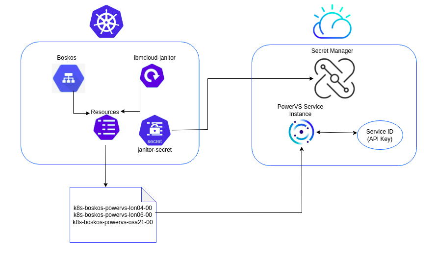

# ibmcloud-janitor

## Introduction

IBM Cloud janitor supports resources of type `powervs-service` by default.
Each resource of type `powervs-service` represents a PowerVS Service Instance of the IBM Cloud.

```yaml
---
resources:
  - type: "powervs-service"
    state: dirty
    names:
    - "k8s-boskos-powervs-lon04-00"
    - "k8s-boskos-powervs-lon04-01"
    - "k8s-boskos-powervs-lon06-00"
    - "k8s-boskos-powervs-osa21-00"
```
> For more information on IBM Power Systems Virtual Servers, refer [here](https://cloud.ibm.com/docs/power-iaas?topic=power-iaas-getting-started).

## Architecture



A resource `k8s-boskos-powervs-lon04-00` representing a  [service instance](https://cloud.ibm.com/docs/power-iaas?topic=power-iaas-creating-power-virtual-server#creating-power-virtual-server) is mapped to a [Service ID](https://cloud.ibm.com/docs/account?topic=account-serviceids&interface=ui) in the IBM Cloud. An [API key](https://cloud.ibm.com/docs/account?topic=account-userapikey&interface=ui) specific to a service ID can be created  and used by an application to authenticate IBM Cloud services.
The API key is updated as a part of resource user data and can be used by an owner acquiring it.

## User Data of a resource

Every resource stores the following user data.

| Name    | Description                    |
| ------- | ------------------------------ |
| `service-instance-id`  | ID of service instance        |
| `api-key` | API Key of a Service ID         |
| `region` | PowerVS region  |
| `zone` | PowerVS zone of a given region  |
| `resource-group` | Resource group of the service instances  |

You can use `/update` to update the resource. Owner needs to match current owner.

```bash
curl -X POST -d '{"service-instance-id":"your-service-instance-id","api-key":"dummyAPiKey","region":"lon","zone":"lon04","resource-group":"cloud-resource-group"}' "http://localhost:8080/update?name=service-instance-1&state=busy&owner=IBMCloudJanitor"
```

## How to run on local k8s cluster

1. Create or navigate to your own cluster
2. Deploy the Boskos service in a particular namespace. Refer [here](https://github.com/kubernetes/test-infra/tree/master/config/prow/cluster/build) on the components to be deployed
3. `kubectl create configmap -n test-pods resources --from-file=/path/to/config.yaml`. See above for an example of how the config file should look
4. `kubectl describe svc -n test-pods boskos` to make sure boskos is running
5. Test from another pod within the cluster
```
kubectl run curl --image=radial/busyboxplus:curl -i --tty
[ root@curl-XXXXX:/ ]$ curl -X POST 'http://boskos.test-pods.svc.cluster.local/acquire?type=project&state=free&dest=busy&owner=user'
````
6. Deploy the IBM Cloud Janitor, `boskos-janitor.yaml`:
```yaml
apiVersion: apps/v1
kind: Deployment
metadata:
  name: boskos-janitor-ibmcloud
  labels:
    app: boskos-janitor-ibmcloud
  namespace: test-pods
spec:
  replicas: 2
  selector:
    matchLabels:
      app: boskos-janitor-ibmcloud
  template:
    metadata:
      labels:
        app: boskos-janitor-ibmcloud
    spec:
      terminationGracePeriodSeconds: 300
      containers:
      - name: boskos-janitor-ibmcloud
        image: ibmcloud-janitor-boskos:latest
        args:
        - --boskos-url=http://boskos.test-pods.svc.cluster.local.
        env: 
        - name: IBMCLOUD_ENV_FILE
          value: "/home/.ibmcloud/key"
        volumeMounts:
          - name: credentials
            mountPath: /home/.ibmcloud
      volumes:
        - name: credentials
          secret:
            secretName: ibmcloud-janitor-secret
```
`IBMCLOUD_ENV_FILE` environment variable stores tha path of the file containing the API key. To see how the `janitor-secret` is made available in the cluster, refer [secret management](#secret-management-for-ibmcloud-janitor).
> Note: The official image for ibmcloud-janitor is not yet available in any container image respository.


## How to run it locally
1. Start boskos with a resources config.yaml, with `go run boskos.go -in_memory -config=/path/to/config.yaml`

2. Start the janitor by running ` go run main.go --boskos-url=http://localhost:8080`. Pass the `--debug` flag set to true for enabling debug logs from the PowerVS client.

3. You can send local requests to boskos by running
```
curl 'http://localhost:8080/acquire?type=powervs-service&state=free&dest=busy&owner=user'
```


## Secret management for ibmcloud janitor
The API key(`janitor-secret`) used to authenticate the `ibmcloud-janitor` is created in the cluster via external secrets operator. For more information on it, refer to [IBM Cloud provider](https://external-secrets.io/v0.5.2/provider-ibm-secrets-manager/).

For more information on IBM Cloud secret manager, refer [here](https://cloud.ibm.com/docs/secrets-manager?topic=secrets-manager-getting-started).
